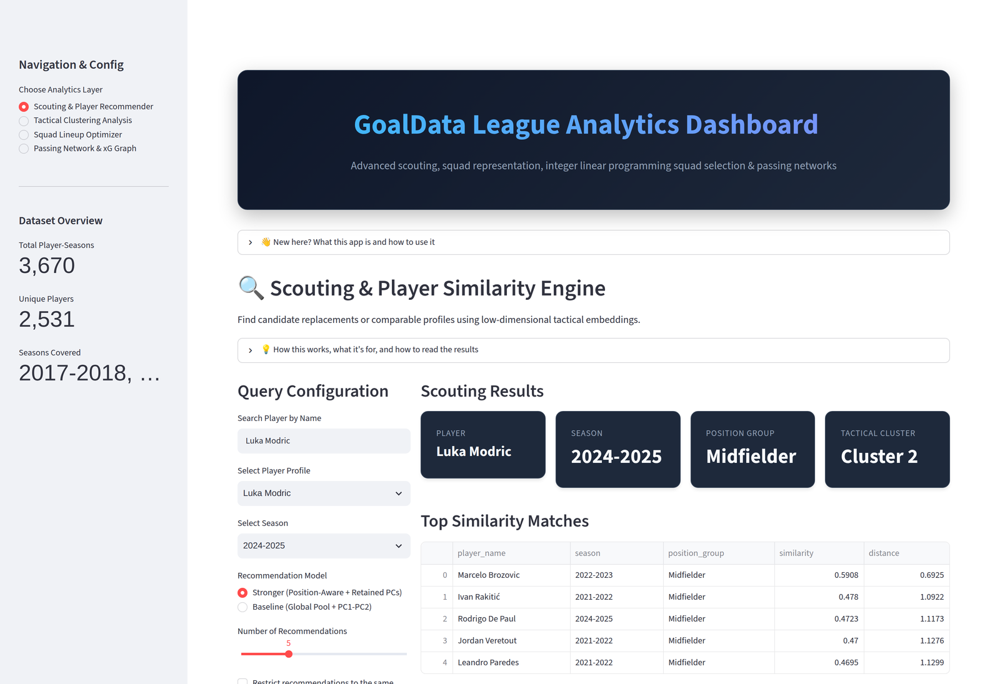

# GoalData League — Football Retrieval & Ranking System

[Live demo](https://tf-goal-data-league.streamlit.app/) · [Static dashboard](https://joanixx.github.io/goaldata-league/)

GoalData League is a retrieval and ranking system for football scouting. It ingests match
records, rosters and event streams into a relational schema, compresses player-season
profiles into PCA embeddings, and serves item-item similarity search on top: given a
player-season, it ranks the closest comparable player-seasons from a position-filtered
candidate pool. The same embedding backs a clustering layer, a k-NN similarity graph and
an ILP starting-XI optimizer.

*Scouting screen: a query player-season, its ranked comparables from the position-filtered pool, and the similarity/distance behind each match.*

## Results

Offline evaluation of the retrieval system against the baseline representation:

| Metric | Baseline | This system |
|--------|----------|-------------|
| Recall@5 | 0.0316 | 0.0939 |
| Recall@10 | 0.0614 | 0.1435 |
| MRR | 0.0773 | 0.1788 |
| MAP | 0.0384 | 0.0927 |
| NDCG@10 | 0.0430 | 0.1146 |

Baseline: Euclidean distance on PC1-PC2 over a global candidate pool. This system:
standardized distance over all 11 retained principal components, restricted to a
same-position candidate pool.

Protocol: leave-one-out over 3,670 player-seasons, 1,662 queries (every player present in
at least two seasons). The query row is removed from the pool before scoring, `player_id`
is used only to build relevance labels and never as a model feature, and both systems are
scored against an identical evaluation pool so the metric measures the representation
rather than the pool.

Reproduce: `python -m src.recommendation_evaluation`

Full report: [`reports/recommendation_evaluation_report.md`](reports/recommendation_evaluation_report.md)
(concrete hit and miss cases: [`reports/recommendation_error_analysis.md`](reports/recommendation_error_analysis.md)).

## Data & provenance

Match results, squads and season totals come from StatsBomb Open Data and FBref (Big-5
leagues, 2005-2025), with Understat per-match records and the official UEFA country
coefficients as secondary sources. Every processed table carries a `data_provenance`
column tagging each row as `observed` (read directly from a source), `derived` (a
deterministic function of observed values) or `simulated` (a documented, literature-anchored
model conditioned on observed quantities — never an unconditioned random draw).
Player identities are resolved with nation-blocked matching, so same-named players from
different countries remain distinct entities.
Full methodology, per-column provenance and citations:
[`reports/methodology_and_citations.md`](reports/methodology_and_citations.md) and
[`data/dictionary.txt`](data/dictionary.txt).

## Data layer

| Table | Rows |
|-------|------|
| Matches (with final scores) | 94,525 |
| Teams | 1,338 |
| Players (identity-deduplicated) | 18,782 |
| Player-attributed goal events | 75,925 |
| Player-seasons | 52,387 |
| Player-match participations | 1,935,463 |
| StatsBomb event-stream actions | 1,751,751 |

Reproduce: `python -m src.build_metrics_report` (writes
[`reports/METRICS_REPORT.md`](reports/METRICS_REPORT.md) verbatim from the pipeline artifacts).

## Project architecture

The project is organized into modular components:
- **`src/`**: Core ingestion, feature-building and modelling logic.
- **`graph/`**: Similarity-graph construction and centrality analysis.
- **`tests/`**: Integration tests and API diagnostic suite.
- **`notebooks/`**: Exploratory data analysis and prototyping.
- **`data/`**: Storage for raw and processed datasets.

## Key features
- **Incremental Enrichment**: The pipeline only processes rows with missing data, saving bandwidth and time.
- **Multi-Source Validation**: Merges UEFA (official lineups/officials) with ESPN (match events/stats).
- **Extensible Source Ingestion**: Reads structured files, directories, and ZIP archives through `src/source_ingestion.py` for CSV, TSV, Excel, JSON, JSONL, HTML, Parquet, and text inputs while skipping audio/video.
- **Fuzzy Matching**: Resolves team name inconsistencies across different data providers.
- **Diagnostic Reporting**: Automated field coverage reports to ensure data integrity.
- **Quality Gates + Parquet**: Cleaned datasets are written as CSV and Parquet. Parquet is used for high-performance analytical queries and dimensionality reduction, preserving native data types. A generated `logs/data_quality_report.json` flags null ratios and formula anomalies before ML use.
- **Dimensionality Reduction (PCA)**: Transforms 3,670 player-season profiles and 33 encoded features into latent tactical embeddings; 11 components retain 90.17% of the variance (`python -m src.build_pca_feature_matrix`, see [`reports/pca_feature_matrix_report.md`](reports/pca_feature_matrix_report.md)).
- **Segmentation**: K-Means and DBSCAN parameter sweeps over the PCA embedding select k=3 at silhouette 0.4536 (`python -m src.build_clustering_analysis`, see [`reports/clustering_validation_report.md`](reports/clustering_validation_report.md)).
- **Similarity Graph**: A k-NN player-similarity graph of 2,531 nodes and 17,777 edges with PageRank and eigenvector centralities (`python graph/analyze_similarity_graph.py`, see [`reports/graph_analysis_report.md`](reports/graph_analysis_report.md)).
- **League-Strength Adjustment (UEFA)**: Decision-layer ratings (ILP starting XI) are scaled by the official season-specific UEFA country coefficients (`src/league_strength.py` + `src/ingest_uefa_coefficients.py`), so 50 goals in a weaker league do not outrank 39 in the Premier League; Champions League minutes carry a premium anchored to UEFA's own CL:EL:Conference bonus ratios.

## Retrieval & ranking
The system is a **content-based item-item similarity and ranking** engine for scouting
(`src/recommendation_engine.py`): given a player-season it ranks the most similar
player-seasons. A **baseline** (Euclidean on PC1-PC2, global pool) is compared against a
**stronger** model (standardized distance over all retained PCs, same-position candidate
pool). `src/recommendation_evaluation.py` runs the leakage-safe leave-one-out evaluation
reported in [Results](#results): the same player across seasons should retrieve itself.

A supervised probe on the same embedding classifies position group (GK/DEF/MID/FW) at
0.7858 macro-F1 across the full catalog and 0.8842 on the StatsBomb-covered subset,
against a 0.1464 majority-class baseline (`python -m src.supervised_evaluation`, see
[`reports/supervised_evaluation_report.md`](reports/supervised_evaluation_report.md)).

## Deliverables

| Deliverable | Location |
|-------------|----------|
| Technical report | `reports/TECHNICAL_REPORT.md` |
| Runbook (canonical reproduction path) | `RUNBOOK.md` |
| Presentation | `reports/PRESENTATION.md` |
| Demo — static dashboard (no server) | `reports/demo/index.html` — auto-deployed to GitHub Pages: https://joanixx.github.io/goaldata-league/ (see `RUNBOOK.md` Step 13) |
| Demo — interactive Streamlit app | `app.py` — live at https://tf-goal-data-league.streamlit.app/ (`streamlit run app.py` for local; `RUNBOOK.md` Step 13b) |
| Monitoring / operationalization plan | `reports/MONITORING_PLAN.md` |
| Limitations and future work | `reports/LIMITATIONS_FUTURE_WORK.md` |
| Metrics (auto-generated from artifacts) | `reports/METRICS_REPORT.md` |

## Quick start

**`RUNBOOK.md` is the canonical, verified reproduction path.** Short version:

1. Install dependencies: `pip install -r requirements.txt`
2. (Optional — the committed parquet already contain the result) Rebuild the data layer:
   `python -m src.ingest_statsbomb_full`, `python -m src.build_real_only_datasets` (observed
   StatsBomb layer), then `python -m src.ingest_real_player_data` and
   `python -m src.build_roster_participation_datasets` (player-match participation layer,
   with per-player season totals anchored to the FBref season totals)
3. PCA feature matrix: `python -m src.build_pca_feature_matrix`
4. Clustering validation (K-Means + DBSCAN sweeps): `python -m src.build_clustering_analysis`
5. Retrieval offline evaluation: `python -m src.recommendation_evaluation` (example queries: `python -m src.recommendation_engine`)
6. Supervised position-classification evaluation: `python -m src.supervised_evaluation`
7. Similarity graph + centralities: see `RUNBOOK.md` Step 7
8. ILP starting XI: `python -m src.optimize_lineup --season 2021-2022 --formation 4-3-3`
9. Demo data + dashboard: `python -m src.serialize_demo_data`, then open `reports/demo/index.html`
10. Tests: `python -m pytest tests -q --ignore=tests/api_diagnostics --ignore=tests/scrapers`

Auxiliary (only when re-ingesting or scraping): `python script.py` (initial relational build),
`python src/impute_missing_stats.py`, `python src/enrich_processed_features.py`,
`python src/enrich_advanced_metrics.py`, `python src/main.py` (scraper pipeline),
`python src/data_merge.py path/to/scraper_results.json`, and
`python tests/api_diagnostics/run_all_tests.py` (network-bound diagnostics).

Advanced metric enrichment writes only to `data/processed`. It does not modify
`data/raw`. Metrics whose cited methods require missing event locations, shot
populations, tracking data, or fitted model coefficients remain `NULL` and are
explained in `data/processed/metadata/advanced_metric_coverage.csv`.

`src/enrich_processed_features.py` preserves observed non-empty values, uses
available top-division source priors for team-season rosters, fills remaining
statistical gaps with deterministic probability rules, and writes both CSV and
Parquet outputs plus `logs/processed_feature_enrichment_report.json`.

For detailed information about each component, refer to the README files in the respective subdirectories.

## Quality gates

Observed rows and non-empty cells are never overwritten; only genuinely missing granular
values are modelled, always through documented formulas and always tagged in the
`data_provenance` column. Each run writes machine-checkable evidence:
`logs/data_quality_report.json` (null ratios, formula anomalies),
`logs/roster_participation_report.json` (row bands and season-total anchoring rates), and
`data/processed/metadata/advanced_metric_coverage.csv` (metrics left `NULL` and why).
See [`reports/missing_data_policies.md`](reports/missing_data_policies.md) and
[`reports/data_pipeline_flow.md`](reports/data_pipeline_flow.md).
